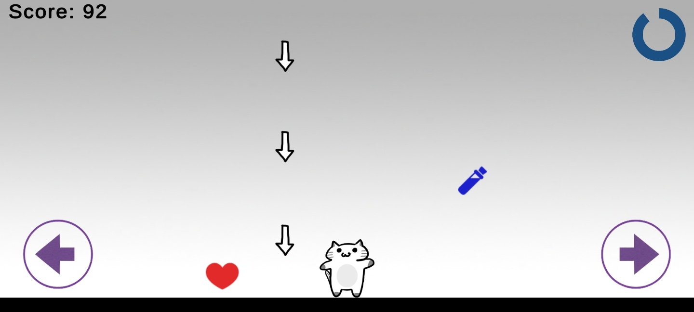

# CatEscape

Unity `2021.3.15f1`로 제작한 2D 캐주얼 게임 프로젝트입니다.

## 소개

`CatEscape`는 플레이어가 장애물을 피하고 아이템을 획득하며 진행하는 2D 게임입니다. 간단한 조작, 아이템 생성, 체력 관리, 씬 전환 기능을 중심으로 구성되어 있습니다.

## 스크린샷

## 프로젝트 구성

- `Assets/`: 씬, C# 스크립트, 프리팹, 이미지 리소스
- `Packages/`: Unity 패키지 의존성 정보
- `ProjectSettings/`: Unity 프로젝트 설정

## 주요 씬

- `Assets/GameScene.unity`: 메인 게임 씬
- `Assets/ClearScene.unity`: 클리어 화면 씬
- `Assets/Scenes/SampleScene.unity`: 기본 샘플 씬

## 주요 스크립트

- `PlayerController.cs`: 플레이어 조작
- `GameDirector.cs`: 게임 상태 관리
- `ArrowController.cs`, `ArrowGenerator.cs`: 장애물 제어 및 생성
- `HeartController.cs`, `HeartGenerator.cs`: 하트 아이템 제어 및 생성
- `PotionController.cs`, `PotionGenerator.cs`: 포션 아이템 제어 및 생성
- `RestartButton.cs`: 재시작 버튼 처리

## 실행 방법

1. Unity Hub를 실행합니다.
2. 이 저장소를 Unity 프로젝트로 추가합니다.
3. Unity `2021.3.15f1` 또는 호환되는 `2021.3 LTS` 버전으로 엽니다.
4. `Assets/GameScene.unity` 씬을 열어 실행합니다.

## 버전 관리 기준

Unity가 자동으로 생성하는 `Library/`, `Logs/`, `UserSettings/`, APK 빌드 파일, Burst debug 폴더, Android 내보내기 결과물인 `phone/` 폴더는 `.gitignore`로 제외했습니다.

## English

Unity 2D casual game project built with Unity `2021.3.15f1`.

### Screenshots

### Project Structure

- `Assets/`: scenes, scripts, prefabs, sprites, and project assets
- `Packages/`: Unity package manifest and lock file
- `ProjectSettings/`: Unity editor and build settings

### Scenes

- `Assets/GameScene.unity`
- `Assets/ClearScene.unity`
- `Assets/Scenes/SampleScene.unity`

### Scripts

- `PlayerController.cs`
- `GameDirector.cs`
- `ArrowController.cs`
- `ArrowGenerator.cs`
- `HeartController.cs`
- `HeartGenerator.cs`
- `PotionController.cs`
- `PotionGenerator.cs`
- `RestartButton.cs`

### Open The Project

1. Open Unity Hub.
2. Add this repository as a Unity project.
3. Open it with Unity `2021.3.15f1` or another compatible 2021.3 LTS editor.
4. Open and run `Assets/GameScene.unity`.

Generated Unity folders such as `Library/`, `Logs/`, `UserSettings/`, APK build outputs, Android export output, and Burst debug folders are intentionally excluded from Git.
